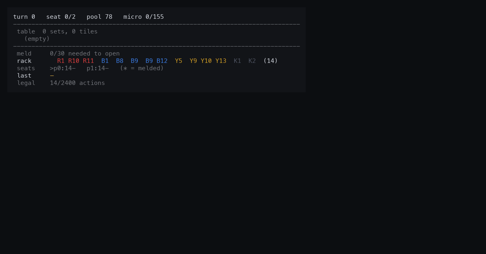
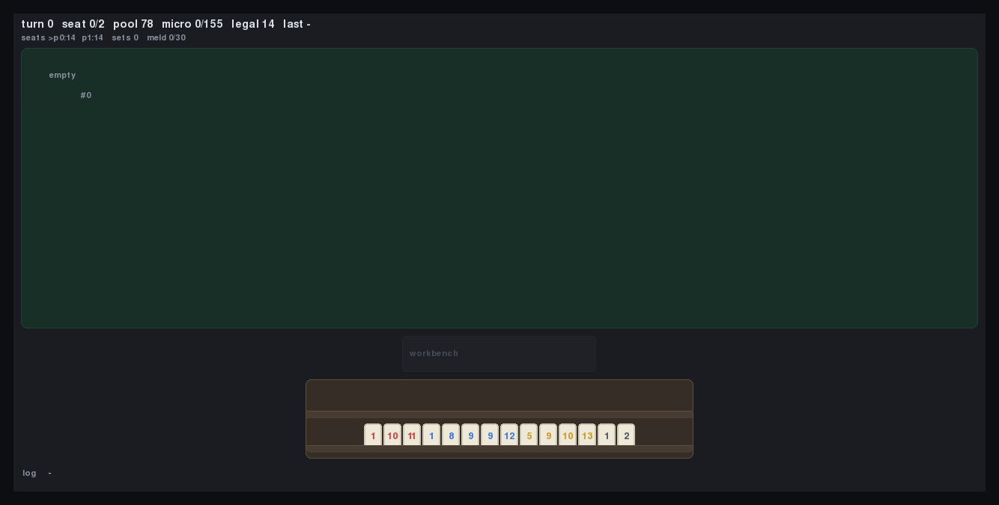

# rummi

[](https://github.com/rsanchezmo/rummi/actions/workflows/ci.yml)

A Rummikub **environment** for reinforcement learning, with opponents to play
against. Batch-native from the ground up, wrapped as a Gymnasium vector env, and
implemented three times over — NumPy, torch and JAX — each verified against the
others bit for bit.

The bundled agents are the point as much as the env is. You get a floor
(`greedy`) and a genuine ceiling (`optimal`, an OR-Tools CP-SAT solver that plays
each turn perfectly), so a new agent has something real to measure itself
against on day one.

```bash
pip install -e '.[dev,env,render,solver]'

python -m rummi.render.record --play --render-mode ansi    # watch a game
python -m rummi.evaluate.run --agent greedy               # score against the agents
python -m rummi.bench.bench_backends --compile             # compare backends
```

```python
import gymnasium as gym
import rummi.env                                    # registers the ids below

env = gym.make_vec("Rummi-2p-v0", num_envs=256)     # or Rummi-3p-v0, Rummi-4p-v0
obs, info = env.reset()
obs, rewards, terminated, truncated, info = env.step(actions)
# info["action_mask"] is (num_envs, 2400) and never all-zero
# info["current_player"] says whose view obs is — one policy plays every seat
```

Seat count is in the id because it changes the observation and action spaces.
Only a vector entry point is registered, so `gym.make` fails by design: a batch
of one is not a single-agent env. `RummiVectorEnv` is importable directly from
`rummi.env.vector_env` when you want to pass a `cfg` of your own.

That env is **self-play**: one policy plays every seat. To hold one seat and let
the bundled agents play the rest:

```python
from rummi.env.fixed_opponent import FixedOpponentEnv
from rummi.rules.config import STANDARD_4P

env = FixedOpponentEnv(num_envs=256, cfg=STANDARD_4P, opponent="greedy")
obs, info = env.reset()      # obs is always a position your seat can act in
```

One `step` is your micro-action plus however many the other seats need to hand
control back, so reward covers their replies rather than arriving on a step you
could not act on. `opponent="optimal"` costs a CP-SAT solve per opponent turn per
env and cannot batch — that one is for evaluation, not training.

Want tensors instead of arrays? Use Gymnasium's own wrappers rather than a mode
of this env — `gymnasium.wrappers.vector.NumpyToTorch`, and `JaxToTorch` /
`JaxToNumpy` once a device backend is wired in. They convert through
`from_dlpack`, so a same-device hand-off is a view, not a copy.

One `step` is one primitive table operation, so a player's turn spans several
steps. Observations are always the acting seat's view, which is what lets a
single shared policy play self-play without learning two conventions.

| `render_mode="ansi"` | `render_mode="human"` |
|:--:|:--:|
|  |  |

The same game, frame for frame. Both are built from one pass over one `GameView`
sequence, so frame *N* of each is the same turn — the turn counter, the flagged
slots and the action log agree because they are the same data, not because two
renderers happen to concur. Every frame is a *committed turn*, which is what
`render_on="turn"` gives you live. Watch the table fill from three sets to
twenty-two and the winner's rack drain to nothing.

## Why Rummikub

Because unrestricted rearrangement makes it genuinely hard. A turn is not "play a
card": it is *leave the table partitioned into valid sets*, and you may take
every existing set apart to do it. Deciding whether a tile multiset admits such a
partition is the problem [Den Hertog & Hulshof
(2006)](https://academic.oup.com/comjnl/article-abstract/49/6/665/356316) solve
by integer programming. The interesting move — steal a tile out of a run to
complete a group, after extending the run so it survives losing it — is invisible
to anything that does not search.

## The opponents

Three strengths, all playable out of the box and all usable as opponents in your
own training loop. Scored here on the `standard-greedy` suite over 120
games; `score` is official Rummikub scoring from the agent's side.


| agent | win rate | score | turns | rack left | stalemates |
|---|---:|---:|---:|---:|---:|
| `random` | 0.0% | −442.3 | 90.6 | 442.3 | 100.0% |
| `weighted-random` | 0.0% | −442.3 | 90.6 | 442.3 | 100.0% |
| `greedy` | 50.0% | +0.0 | 124.7 | 48.2 | 98.3% |
| `rearrange` | 85.0% | +31.9 | 129.3 | 21.7 | 80.0% |
| `optimal` (CP-SAT) | **100.0%** | **+44.6** | 65.7 | 0.0 | 0.0% |

**Read the random row as a warning, not a floor.** On the standard config random
play is *byte-identical to passing every turn* — same scores, same turn counts. It
can never assemble a legal 30-point opening meld, so it never places a tile and
its choices have no effect on the game whatsoever. Beating random says nothing.
**Greedy at 50% is the real floor**; it is also the suite's own opponent, which
is why it scores exactly even.

The ladder is one idea: **how much of the table are you willing to take apart?**
`greedy` never rearranges, so once it can neither append to a set nor lay one
from its rack it just draws — which is why it stalls out in 98% of games.
`rearrange` steals exactly **one** tile from a set that stays legal without it,
and that alone is worth 35 points of win rate. `optimal` repartitions the whole
table at once. The distance between those last two is the value of rearranging
more than one tile at a time.

## Writing an agent

Agents plug into the same interface the bundled ones use — there is one way to
write an agent, and the bundled ones are not special. An agent sees an
observation and a legal-action mask, and nothing else. That is
the integrity property the whole benchmark rests on: the observation exposes only
what a player is entitled to know — your rack, the table, and `unseen` (the pool
and your opponents' racks combined, indistinguishable from one another). Every
reference agent obeys this, the CP-SAT one included, which is a proof the
observation is sufficient to play optimally.

```python
import numpy as np
from rummi.evaluate.protocol import SUITE_BY_NAME, evaluate

class MyAgent:
    name = "mine"

    def __init__(self, cfg):
        self.cfg = cfg

    def reset(self, n_envs):
        ...                      # clear per-env memory; envs are recycled

    def act(self, obs, mask, active=None):
        # obs["rack"], obs["table_sets"], obs["unseen"], ...
        # mask is (n_envs, n_actions) and never all-zero: DRAW is always legal.
        # `active` marks the envs you control — honour it if you cache plans.
        return np.argmax(mask, axis=-1)

print(evaluate("mine", SUITE_BY_NAME["tiny"], build_agent=MyAgent).report())
```

A turn spans several `act` calls, so an agent that plans a whole turn should
cache its plan and consume it; subclass `rummi.agents.base.PlanningAgent` to get
that bookkeeping for free. [`CONTRIBUTING.md`](CONTRIBUTING.md) has the rest. Proposing a masked-out action **disqualifies** the run
rather than costing reward: the mask exactly describes what the rules permit, so
an illegal action is a bug, not a strategy.

### Every registered env has a score

`Rummi-3p-v0` and `Rummi-4p-v0` are scored too, on the `standard-3p` (165 games)
and `standard-4p` (220 games) suites, so an agent trained at any seat count has a
baseline to beat.

| agent | win 2p | win 3p | win 4p | score 2p | score 3p | score 4p |
|---|---:|---:|---:|---:|---:|---:|
| `greedy` | 50.0% | 33.3% | 25.0% | +0.0 | +0.0 | +0.0 |
| `rearrange` | 85.0% | 64.8% | 54.1% | +31.9 | +49.9 | +60.1 |
| `optimal` | 100.0% | 100.0% | 99.5% | +44.6 | +94.0 | +139.4 |

Two things the seat count does to the ladder. `greedy` lands on exactly
`1 / n_players` in every column — it is each suite's own opponent, and that the
number is *exact* rather than close is the rotation check working, not a
coincidence. And `optimal` stops being perfect at four seats: with three
opponents taking turns between yours, playing every turn perfectly is no longer
quite enough, which finally makes the top rung something a submission can aim at.

## Scoring yourself

`rummi.evaluate` plays your agent against the bundled ones under a frozen,
versioned protocol (`PROTOCOL_VERSION`), so a number you quote today still means
the same thing later.

| suite | config | opponent | deals |
|---|---|---|---|
| `tiny` | 3 colours × 4 numbers | `greedy` | 100 |
| `standard-greedy` | full 106-tile game | `greedy` | 200 |
| `standard-optimal` | full 106-tile game | `optimal` | 100 |

`standard-optimal` runs CP-SAT once per turn per env, so it takes roughly a
minute per hundred games — fine for a score, too slow to iterate against. Use
`tiny` while developing.

Every deal is played **twice, with the seats swapped**. That cancels both the
turn-order advantage and the luck of the deal, so an agent mirrored against
itself scores exactly `1 / n_players` and +0.0 — not that within error bars. Each game's
seed is derived from its index alone, so batching cannot change which deals run.

## How a turn is expressed

One `step` is one primitive table operation; a turn is a sequence of them ending
in `END_TURN` or `DRAW`. Tiles picked up mid-turn sit in a *workbench*, and the
table only has to be whole again when the turn commits.

| action | count | effect |
|---|---:|---|
| `PLACE(kind)` | 53 | rack → workbench |
| `PICK(slot, pos)` | 455 | one tile of a set → workbench |
| `DISSOLVE(slot)` | 35 | whole set → workbench |
| `ASSIGN(kind, slot)` | 1855 | workbench → set slot |
| `END_TURN` | 1 | commit, only legal when the table is valid |
| `DRAW` | 1 | revert the turn, take a tile, pass |

This makes every legality check O(1) — no NP-hard partition test anywhere in the
hot loop — and it mirrors how the game is physically played. It is also
**complete**: every table CP-SAT proposes is reachable through these actions
within the per-turn budget, which the test suite checks constructively on all
three configs. `DRAW` is never masked, so the MDP cannot deadlock and no mask row
is ever all-zero.

Full rules-to-arrays contract: [`SPEC.md`](SPEC.md).

## Backends

Three implementations, written independently against `SPEC.md` rather than
against a shared abstraction, so a comparison measures implementations and not
the cost of a common layer. `rummi.env.api` reconciles them at the boundary,
so they are swappable by name.


| backend | peak env-steps/s | vs NumPy | at batch |
|---|---:|---:|---:|
| NumPy (reference) | 67k | 1.0x | 4,096 |
| torch CPU | 68k | 1.0x | 16,384 |
| torch CPU + `compile` | 296k | 4.4x | 16,384 |
| torch MPS | 252k | 3.8x | 16,384 |
| torch MPS + `compile` | **349k** | **5.2x** | 1,024 |
| JAX (`lax.scan`) | 223k | 3.3x | 4,096 |

Standard config, best of three, with the action choice held to the cheapest
possible so the figure measures the environment and not a policy. Numbers from
`docs/data/backends.json`; regenerate with
`python -m rummi.bench.bench_backends --compile --json docs/data/backends.json`.

Read the shape of the curves rather than the top row:

- **Fusion is the whole story, not the framework.** Uncompiled torch CPU sits
  exactly on the NumPy line until `compile` fuses it, then it is 4.4x.
- **The GPU wins in the middle and gives it back.** `torch-mps+compile` peaks at
  349k around a thousand environments and settles near 250k at sixteen thousand,
  where `torch-cpu+compile` overtakes it at 296k. Past a few thousand envs this
  workload stops being compute-bound.
- **Both frameworks agree on CPU** (4.4x and 3.3x). Two implementations written
  independently landing in the same band is decent evidence that 3–4x is the real
  headroom over NumPy rather than a tuning artefact.
- **JAX is fastest at small batch** — 2.2x at 64 envs, where torch is still
  paying fixed per-call costs — and flattest thereafter. `lax.scan` buys almost
  nothing over the fused version: the per-step work already dominates, so the
  Python loop was never the bottleneck.

JAX here is CPU-only; it has no production Metal backend, so it cannot be
compared against MPS on equal hardware. On a CUDA box, re-measure.

Conformance is not assumed. Every backend replays recorded trajectories and must
reproduce 42 state digests per config, and masks and rewards are compared against
the reference step for step.

## Layout

```
rummi/
  rules/        backend-free: the rules as data (config, tile encoding, actions)
  env/
    numpy/      the reference implementation: set kernel, masks, engine, dealing
    torch/      independent torch implementation
    jax/        independent JAX implementation
    api.py      uniform adapter, so backends are swappable by name
    vector_env.py     Gymnasium VectorEnv
    observation.py    the observation an agent is allowed to see
  agents/       the Agent protocol and the bundled opponents
  evaluate/     scoring an agent against those opponents
  solver/       brute-force oracles, candidate sets, CP-SAT, plan translator
  render/       shared board layout, terminal view, pygame window, play UI, record/replay
  bench/        throughput benchmarks and the invariant fuzzer
```

## What is verified

- **224 tests.** The set-validity kernel is checked *exhaustively* against a
  brute-force oracle on the reduced configs, including the closed-form
  "could I add this tile?" predicate.
- **10.5M fuzz steps, zero invariant violations.** Tile conservation, mask
  soundness, exact turn reversion, and termination, on every step.
- **Random play cannot test this environment.** In 10M steps it assembled a legal
  opening meld four times. Any test suite here needs greedy or better to reach
  melding, winning, or `END_TURN` at all — which is why the fuzzer takes a
  `--policy` flag.

```bash
pytest                                                  # everything
python -m rummi.bench.fuzz --policy greedy --games 500  # invariant fuzzing
python -m rummi.bench.tournament                        # baselines head to head
```

## Watching games

Two live views over one shared view model — a pygame window and an in-place
terminal view that redraws only the lines that changed.

```bash
python -m rummi.render.record --play --render-mode ansi --fps 6
python -m rummi.render.record --play --render-mode human --policy optimal
python -m rummi.render.record --play --out game.jsonl && \
python -m rummi.render.record --replay game.jsonl --pause
```

Recordings store the config, the seed and the action sequence — nothing else. The
simulator holds no RNG in its step function, so replaying those actions
reconstructs every intermediate state exactly.

By default the live views draw once per **committed turn**, since a turn is the
meaningful unit of play and mid-turn frames are mostly one tile moving. Pass
`--render-on step` to see every micro-action instead — the workbench filling, the
table temporarily in pieces — which is what you want when reasoning about the
action space.

To record with Gymnasium's own tooling instead, `render_mode="rgb_array"` returns
a tuple of frames per the vector convention, so `RecordVideo` works directly:

```python
from gymnasium.wrappers.vector import RecordVideo
from rummi.env.vector_env import RummiVectorEnv

env = RecordVideo(                                  # writes MP4; needs moviepy
    RummiVectorEnv(num_envs=1, cfg=STANDARD, render_mode="rgb_array"),
    video_folder="videos", name_prefix="rummi",
)
```

Use `num_envs=1`: Gymnasium tiles one frame per sub-env, and only
`render_env_index` is ever drawn — rendering all N games to show N copies of the
same thing would cost N times as much.

The animations at the top of this page are generated, not pasted, and
regenerating them is byte-identical:

```bash
python tools/render_docs.py --format gif --out docs/render     # both animations
python tools/render_docs.py --format png --out still.png       # one frame, side by side
```

## Playing a hand yourself

```bash
python -m rummi.render.play --opponent optimal
```

Drag a tile off your rack onto the table, or off one set onto another to
rearrange. A press picks the tile up and a release puts it down, so clicking
works too: click to take, click again where it should go. `UNDO` walks back a
mis-drag, `END TURN` commits.

The window says things rather than printing them: a pill per seat showing whose
turn it is and how many tiles are left, a bar for how close your opening meld is,
a score under each set, a red ring on any set that is not legal yet, and a blue
one on every set the tile in your hand could go to.

The reason this is worth more than the fun of it: **the same `action_mask` an
agent consumes drives the interface.** It decides which tiles can be lifted and
which sets light up as you drag, so an illegal move is not rejected — it is
inexpressible, and a test fires random clicks across a whole game asserting that
no gesture can produce an action the mask forbids. Every drag emits the same
micro-actions an agent has to emit, which makes the window a way to read the
action space rather than a separate way of playing.

Undo is worth a note too. The MDP has no "unplace" — a tile leaves the workbench
by being assigned or by `DRAW` abandoning the turn — so rather than add an action
to fix a human's mis-click, `UNDO` rewinds to the turn's opening state and replays
it one action short. The engine every agent sees is untouched.
