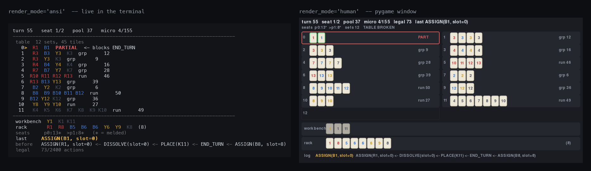

# rummi

A Rummikub **environment** for reinforcement learning, with opponents to play
against. Batch-native from the ground up, wrapped as a Gymnasium vector env, and
implemented three times over — NumPy, torch and JAX — each verified against the
others bit for bit.

The bundled agents are the point as much as the env is. You get a floor
(`greedy`) and a genuine ceiling (`optimal`, an OR-Tools CP-SAT solver that plays
each turn perfectly), so a new agent has something real to measure itself
against on day one.

```bash
pip install -e '.[dev,env,render,solver]'

python -m rummi.render.record --play --render-mode ansi    # watch a game
python -m rummi.evaluate.run --agent greedy               # score against the agents
python -m rummi.bench.bench_backends --compile             # compare backends
```

```python
from rummi.env.vector_env import RummiVectorEnv

env = RummiVectorEnv(num_envs=256, seed=0)          # Gymnasium VectorEnv
obs, info = env.reset()
obs, rewards, terminated, truncated, info = env.step(actions)
# info["action_mask"] is (num_envs, 2400) and never all-zero
# info["current_player"] says whose view obs is — one policy plays every seat
```

One `step` is one primitive table operation, so a player's turn spans several
steps. Observations are always the acting seat's view, which is what lets a
single shared policy play self-play without learning two conventions.



Both panels above are the *same step*, rendered from a single `GameView` — the
terminal view and the window are two renderers over one shared view model, not
two things that happen to agree. Mid-turn here: a set has been taken apart, three
tiles sit in the workbench, and slot 0 is flagged in both views because a
two-tile set is not legal yet, so `END_TURN` stays masked.

## Why Rummikub

Because unrestricted rearrangement makes it genuinely hard. A turn is not "play a
card": it is *leave the table partitioned into valid sets*, and you may take
every existing set apart to do it. Deciding whether a tile multiset admits such a
partition is the problem [Den Hertog & Hulshof
(2006)](https://academic.oup.com/comjnl/article-abstract/49/6/665/356316) solve
by integer programming. The interesting move — steal a tile out of a run to
complete a group, after extending the run so it survives losing it — is invisible
to anything that does not search.

## The opponents

Three strengths, all playable out of the box and all usable as opponents in your
own training loop. Scored here on the `standard-greedy` suite over 120 mirrored
games; `score` is official Rummikub scoring from the agent's side.

| agent | win rate | score | turns | rack left | stalemates |
|---|---:|---:|---:|---:|---:|
| `random` | 0.0% | −442.3 | 90.6 | 448.1 | 100% |
| `weighted-random` | 0.0% | −442.3 | 90.6 | 448.1 | 100% |
| `greedy` | 50.0% | +0.0 | 124.7 | 47.5 | 98.3% |
| `optimal` (CP-SAT) | **100.0%** | **+44.6** | 65.7 | 0.0 | 0% |

**Read the random row as a warning, not a floor.** On the standard config random
play is *byte-identical to passing every turn* — same scores, same turn counts. It
can never assemble a legal 30-point opening meld, so it never places a tile and
its choices have no effect on the game whatsoever. Beating random says nothing.
**Greedy at 50% is the real floor**; it is also the suite's own opponent, which
is why it scores exactly even.

The gap between greedy and optimal is precisely the value of *rearranging the
table*, because greedy never does it.

## Writing an agent

Agents plug into the same interface the bundled ones use. An agent sees an
observation and a legal-action mask, and nothing else. That is
the integrity property the whole benchmark rests on: the observation exposes only
what a player is entitled to know — your rack, the table, and `unseen` (the pool
and your opponents' racks combined, indistinguishable from one another). Every
reference agent obeys this, the CP-SAT one included, which is a proof the
observation is sufficient to play optimally.

```python
import numpy as np
from rummi.evaluate.protocol import SUITE_BY_NAME, evaluate

class MyAgent:
    name = "mine"

    def __init__(self, cfg):
        self.cfg = cfg

    def reset(self, n_envs):
        ...                      # clear per-env memory; envs are recycled

    def act(self, obs, mask, active=None):
        # obs["rack"], obs["table_sets"], obs["unseen"], ...
        # mask is (n_envs, n_actions) and never all-zero: DRAW is always legal.
        # `active` marks the envs you control — honour it if you cache plans.
        return np.argmax(mask, axis=-1)

print(evaluate("mine", SUITE_BY_NAME["tiny"], build_agent=MyAgent).report())
```

A turn spans several `act` calls, so an agent that plans a whole turn should
cache its plan and consume it; subclass `rummi.agents.base.PlanningAgent` to get
that bookkeeping for free. Proposing a masked-out action **disqualifies** the run
rather than costing reward: the mask exactly describes what the rules permit, so
an illegal action is a bug, not a strategy.

## Scoring yourself

`rummi.evaluate` plays your agent against the bundled ones under a frozen,
versioned protocol (`PROTOCOL_VERSION`), so a number you quote today still means
the same thing later.

| suite | config | opponent | deals |
|---|---|---|---|
| `tiny` | 3 colours × 4 numbers | `greedy` | 100 |
| `standard-greedy` | full 106-tile game | `greedy` | 200 |
| `standard-optimal` | full 106-tile game | `optimal` | 100 |

`standard-optimal` runs CP-SAT once per turn per env, so it takes roughly a
minute per hundred games — fine for a score, too slow to iterate against. Use
`tiny` while developing.

Every deal is played **twice, with the seats swapped**. That cancels both the
first-player advantage and the luck of the deal, so an agent mirrored against
itself scores exactly 50.0% and +0.0 — not 50% within error bars. Each game's
seed is derived from its index alone, so batching cannot change which deals run.

## How a turn is expressed

One `step` is one primitive table operation; a turn is a sequence of them ending
in `END_TURN` or `DRAW`. Tiles picked up mid-turn sit in a *workbench*, and the
table only has to be whole again when the turn commits.

| action | count | effect |
|---|---:|---|
| `PLACE(kind)` | 53 | rack → workbench |
| `PICK(slot, pos)` | 455 | one tile of a set → workbench |
| `DISSOLVE(slot)` | 35 | whole set → workbench |
| `ASSIGN(kind, slot)` | 1855 | workbench → set slot |
| `END_TURN` | 1 | commit, only legal when the table is valid |
| `DRAW` | 1 | revert the turn, take a tile, pass |

This makes every legality check O(1) — no NP-hard partition test anywhere in the
hot loop — and it mirrors how the game is physically played. It is also
**complete**: every table CP-SAT proposes is reachable through these actions
within the per-turn budget, which the test suite checks constructively on all
three configs. `DRAW` is never masked, so the MDP cannot deadlock and no mask row
is ever all-zero.

Full rules-to-arrays contract: [`SPEC.md`](SPEC.md).

## Backends

Three implementations, written independently against `SPEC.md` rather than
against a shared abstraction, so a comparison measures implementations and not
the cost of a common layer. `rummi.env.api` reconciles them at the boundary,
so they are swappable by name.

| backend | env-steps/s | vs NumPy |
|---|---:|---:|
| NumPy (reference) | 64k | 1.0x |
| torch CPU | 65k | 1.0x |
| torch CPU + `compile` | 257k | 4.0x |
| torch MPS | 223k | 3.5x |
| torch MPS + `compile` | **537k** | **8.5x** |
| JAX CPU (`lax.scan`) | 203k | 3.2x |

Standard config, `B=16384`, cheapest possible action choice so the figure is the
environment rather than a policy. Two caveats worth more than the top row: the 8.5x is a **GPU** result
(torch on Metal; JAX has no production Metal backend, so it cannot be compared on
equal hardware here), and both frameworks land at 3–4x on CPU — two independent
implementations agreeing is good evidence that 3–4x is the real headroom over
NumPy, not a tuning artefact. Uncompiled torch is exactly at NumPy parity, so
fusion is the whole story.

Conformance is not assumed. Every backend replays recorded trajectories and must
reproduce 42 state digests per config, and masks and rewards are compared against
the reference step for step.

## Layout

```
rummi/
  rules/        backend-free: the rules as data (config, tile encoding, actions)
  env/
    numpy/      the reference implementation: set kernel, masks, engine, dealing
    torch/      independent torch implementation
    jax/        independent JAX implementation
    api.py      uniform adapter, so backends are swappable by name
    vector_env.py     Gymnasium VectorEnv
    observation.py    the observation an agent is allowed to see
  agents/       the Agent protocol and the bundled opponents
  evaluate/     scoring an agent against those opponents
  solver/       brute-force oracles, candidate sets, CP-SAT, plan translator
  render/       live terminal view, pygame window, record/replay
  bench/        throughput benchmarks and the invariant fuzzer
```

## What is verified

- **183 tests.** The set-validity kernel is checked *exhaustively* against a
  brute-force oracle on the reduced configs, including the closed-form
  "could I add this tile?" predicate.
- **10.5M fuzz steps, zero invariant violations.** Tile conservation, mask
  soundness, exact turn reversion, and termination, on every step.
- **Random play cannot test this environment.** In 10M steps it assembled a legal
  opening meld four times. Any test suite here needs greedy or better to reach
  melding, winning, or `END_TURN` at all — which is why the fuzzer takes a
  `--policy` flag.

```bash
pytest                                                  # everything
python -m rummi.bench.fuzz --policy greedy --games 500  # invariant fuzzing
python -m rummi.bench.tournament                        # baselines head to head
```

## Watching games

Two live views over one shared view model — a pygame window and an in-place
terminal view that redraws only the lines that changed.

```bash
python -m rummi.render.record --play --render-mode ansi --fps 6
python -m rummi.render.record --play --render-mode human --policy optimal
python -m rummi.render.record --play --out game.jsonl && \
python -m rummi.render.record --replay game.jsonl --pause
```

Recordings store the config, the seed and the action sequence — nothing else. The
simulator holds no RNG in its step function, so replaying those actions
reconstructs every intermediate state exactly.

The image at the top of this page is generated, not pasted:

```bash
python tools/make_screenshot.py --out docs/render.png
```
